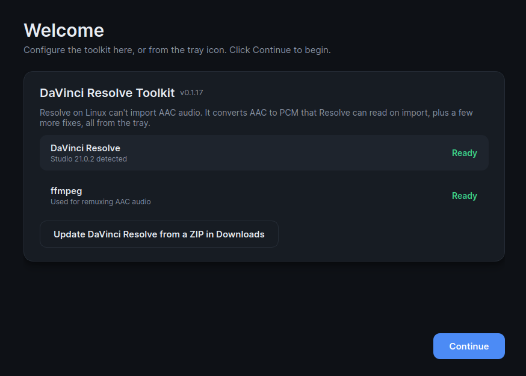
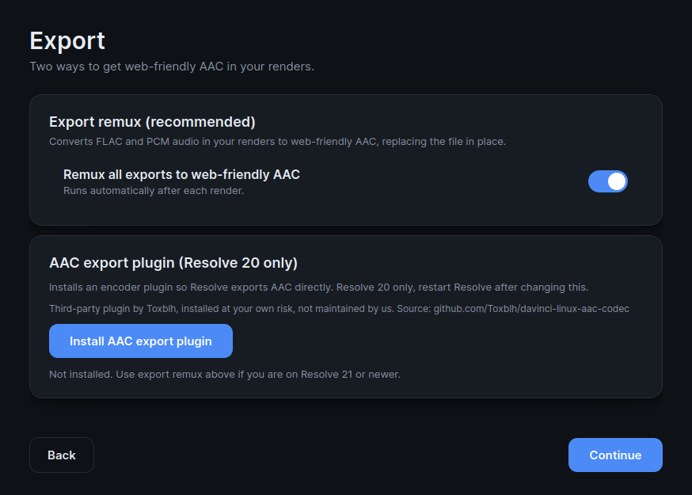
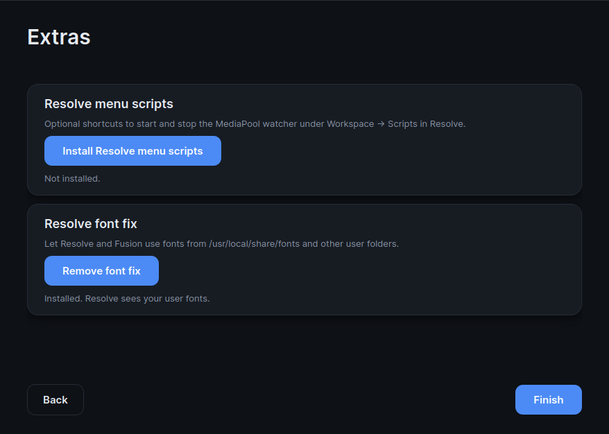
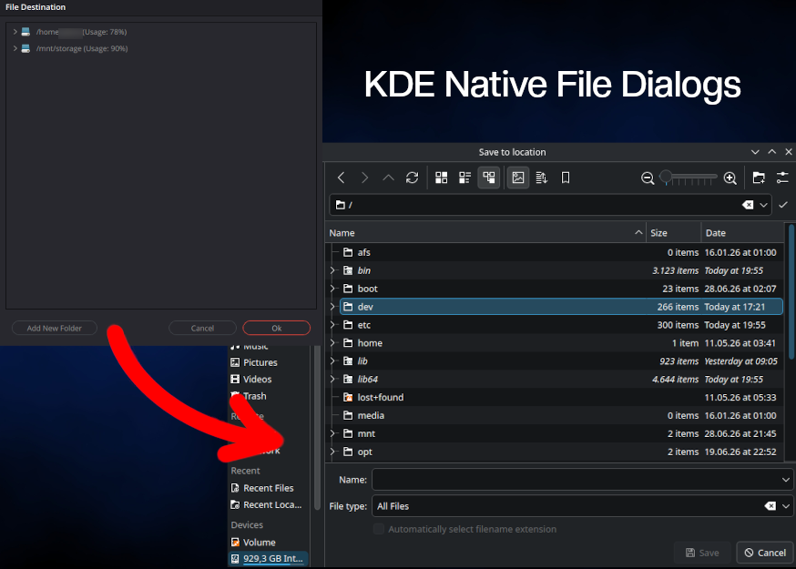

# DaVinci Resolve Toolkit for Linux

A Linux companion for DaVinci Resolve, controlled from a guided setup window and
a system tray. Its main job: Resolve on Linux can't import AAC audio, so the
toolkit converts AAC to Resolve-friendly PCM and swaps imported clips
automatically. Video is copied, not re-encoded; your originals stay untouched.

- Install guide video: https://youtu.be/cBxr6CLhnVI
- Inspired by: https://github.com/jchai01/davinci-resolve-aac-workaround-macro

## Screenshots

<table>
  <tr>
    <td></td>
    <td></td>
  </tr>
  <tr>
    <td></td>
    <td></td>
  </tr>
</table>

## Install

**Discover / GNOME Software (Fedora):**

```bash
sudo dnf copr enable raydurlok/davinci-resolve-toolkit
sudo dnf install davinci-resolve-toolkit
```

Once the Copr repo is enabled it also appears as a searchable tile in Discover.

**From the release tarball** (any distro):

```bash
curl -L https://github.com/RayDurlok/DaVinci-Resolve-AAC-Scripts-for-Linux/releases/latest/download/resolve-aac-tools-linux.tar.gz -o resolve-aac-tools-linux.tar.gz
tar xzf resolve-aac-tools-linux.tar.gz
cd resolve-aac-tools
./install_user_tools.sh
```

Then start the tray:

```bash
resolve-aac-tray
```

On first run a guided setup window opens. Reopen it any time from the tray
(`Settings`) or with `resolve-aac-settings`. The tray logs to
`/tmp/DaVinciResolveToolkit.log`.

**Requirements:** DaVinci Resolve (Studio), Python 3, `ffmpeg`/`ffprobe`, PySide6,
and Resolve scripting enabled (`Preferences -> System -> General -> External
scripting using: Local`, usually on by default). The installer checks these and
offers to install missing ones on common distros. Tested on Fedora.

For unattended installs: `./install_user_tools.sh --yes` (add `--no-deps` to skip
the dependency checks).

### Update

Re-download and re-run the installer; your settings and cache are kept, and a
running tray restarts itself:

```bash
curl -L https://github.com/RayDurlok/DaVinci-Resolve-AAC-Scripts-for-Linux/releases/latest/download/resolve-aac-tools-linux.tar.gz -o resolve-aac-tools-linux.tar.gz
tar xzf resolve-aac-tools-linux.tar.gz && cd resolve-aac-tools && ./install_user_tools.sh
```

To uninstall: `./uninstall_user_tools.sh` (keeps the remux cache unless you pass
`--remove-cache`).

## Using it

- **Left-click** the tray icon to start Resolve with AAC watching; **right-click**
  for settings.
- Enable **Watch manual Resolve starts** to also cover Resolve opened from the
  normal launcher (strict process detection, checked about every 10s).
- **Start tray at login** is off on fresh installs — enable it if you want it.
- Remux output goes beside the source in `<source>/aac_remux/` by default, or into
  one cache folder (`~/.cache/resolve-aac-remux`) if you enable **Use single cache
  folder**.

When Resolve is started through the tray, closing Resolve also stops the watcher;
the tray icon stays. For best results, import into the Media Pool first, then edit.

### Undo and on-demand remux

Remuxing is reversible and can be triggered by hand, from the tray or
`Workspace -> Scripts -> DaVinci Resolve Toolkit`:

- **Restore Original Sources** — put every remuxed clip in the project back to its
  original file (stops the watcher first so it doesn't re-remux).
- **Remux All AAC Media** — remux every AAC clip in the media pool now.
- **Resolve AAC Current Clip** — remux just the clip under the playhead.

All three replace the Media Pool clip (video copied, audio to PCM), follow your
cache setting, and are undone by Restore.

## AAC in exports

Resolve on Linux also can't export AAC directly:

- **Resolve 21:** enable the tray toggle **Remux all exports in webfriendly AAC**.
  It watches renders and rewrites FLAC/PCM/broken AAC to browser-friendly AAC-LC
  in place (video copied), with a notification when done. Healthy AAC and
  audio-only PCM masters are left alone.
- **Resolve 20 only:** **AAC export plugin: Install** adds native AAC export
  (Toxblh's [davinci-linux-aac-codec](https://github.com/Toxblh/davinci-linux-aac-codec)).
  It crashes Resolve 21 — use the toggle there instead.

## Optional extras

- **Native KDE file dialogs** (off by default): routes Resolve's file dialogs
  (Export Still, Import, Deliver destination, Media relink) through the native
  KDE/portal picker. Needs `python3-gobject` and `kdialog` (installer adds them);
  restart Resolve after toggling.
- **Resolve font fix**: one-time install so Resolve/Fusion see fonts from
  `/usr/local/share/fonts`, `~/.local/share/fonts`, and `~/.fonts`.
- **DaVinci Resolve Updater** (`resolve-update-from-downloads`): installs the
  newest `DaVinci_Resolve*_Linux.zip` from `~/Downloads` via Blackmagic's
  installer, then refreshes the launcher (incl. the Fedora GLib fix).

## Commands

Most users only need the tray. Full list:

```bash
resolve-aac-tray                     # tray app
resolve-aac-start                    # tray + start Resolve
resolve-aac-settings                 # setup/settings window
resolve-aac-mediapool-watch[-stop]   # media pool watcher
resolve-aac-current-clip             # remux the current clip
resolve-aac-import <file|folder>     # batch convert
resolve-aac-export-watch             # export remux watcher
resolve-aac-timeline-watch[-stop]    # legacy: adds a PCM track instead of replacing
resolve-with-fonts                   # launch Resolve with the font fix
resolve-update-from-downloads        # update Resolve from ~/Downloads
```

## Support

If this saves you time, you can support the work:

[](https://www.paypal.com/donate/?hosted_button_id=V4HH8D9L36UPG)

## Notice

Not affiliated with or endorsed by Blackmagic Design. DaVinci Resolve is a
trademark of Blackmagic Design.

## License

GPLv3.
