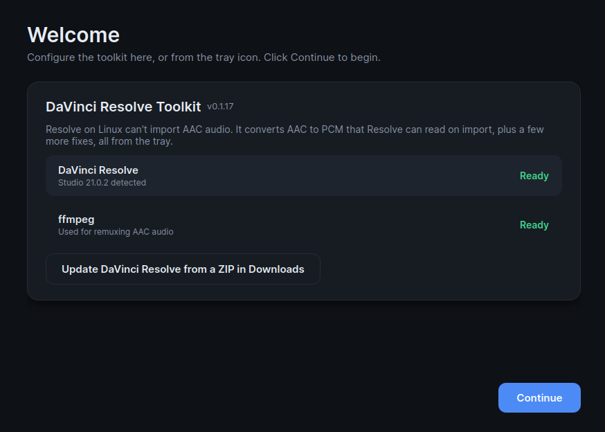
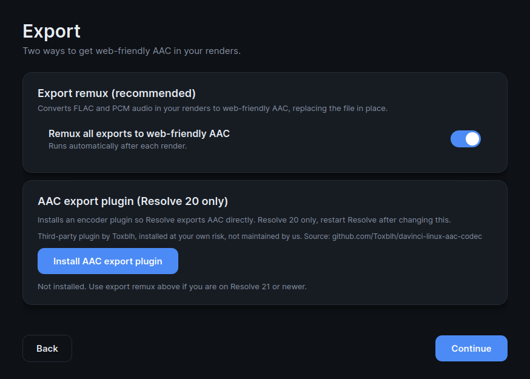
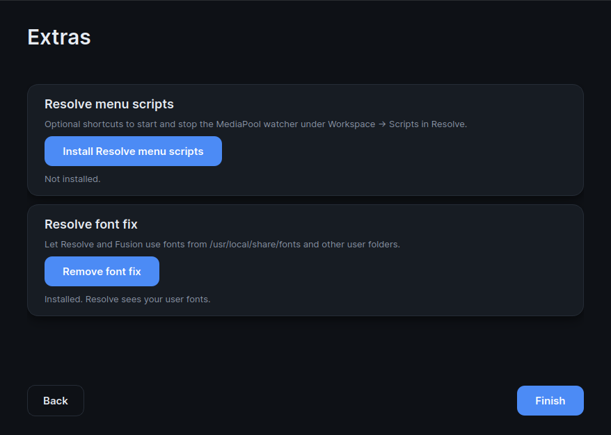
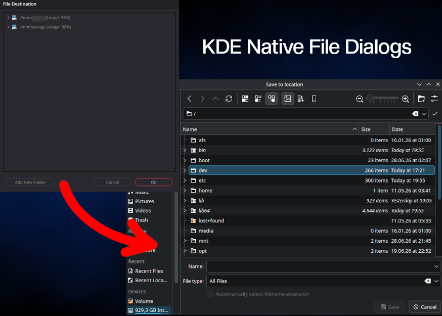

# DaVinci Resolve Toolkit for Linux

A Linux companion for DaVinci Resolve, controlled from settings and a system tray.
**Native AAC** adds an opt-in import patch and experimental direct AAC-LC export
for Resolve Studio 21. **Legacy conversions** remain available for other versions.

- Original install guide video (Legacy workflow): https://youtu.be/cBxr6CLhnVI
- Inspired by: https://github.com/jchai01/davinci-resolve-aac-workaround-macro
- Native import patch: [resolve-aacfix](https://github.com/josephg/resolve-aacfix)
  by **Seph Gentle (josephg)**. Export adapter based on
  [Toxblh's AAC encoder](https://github.com/Toxblh/davinci-linux-aac-codec).

## Screenshots

<table>
  <tr>
    <td></td>
    <td></td>
  </tr>
  <tr>
    <td></td>
    <td></td>
  </tr>
</table>

## Install

**Discover / GNOME Software (Fedora):**

```bash
sudo dnf copr enable raydurlok/davinci-resolve-toolkit
sudo dnf install davinci-resolve-toolkit
```

Once the Copr repo is enabled it also appears as a searchable tile in Discover.

**From the release tarball** (any distro):

```bash
curl -L https://github.com/RayDurlok/DaVinci-Resolve-AAC-Scripts-for-Linux/releases/latest/download/resolve-aac-tools-linux.tar.gz -o resolve-aac-tools-linux.tar.gz
tar xzf resolve-aac-tools-linux.tar.gz
cd resolve-aac-tools
./install_user_tools.sh
```

Keep the extracted `resolve-aac-tools` folder; the installed launch commands use it.

Then start the tray:

```bash
resolve-aac-tray
```

On first run, Settings opens. Expand **Quick guide** on the Welcome page for
the essentials, choose a workflow on the next page, then click **Finish**.
Reopen Settings with a left-click on the tray or `resolve-aac-settings`.

The toolkit runs once per user. Launching it again opens the existing settings
window; the Resolve launch command is also forwarded to the running instance.

**Requirements:** DaVinci Resolve Studio, Python 3, `ffmpeg`/`ffprobe` and
PySide6 (required for the tray on every distro). The installer checks software
dependencies and asks before installing missing packages on supported distros.
Install Resolve separately. For Legacy watchers and scripts, also enable
`Preferences -> System -> General -> External scripting using: Local` in Resolve;
the toolkit installer does not change this preference. Tested on Fedora.

For unattended installs: `./install_user_tools.sh --yes` (add `--no-deps` to skip
the dependency checks).

### Update

For a Fedora/Copr installation:

```bash
sudo dnf upgrade davinci-resolve-toolkit
```

For a tarball installation, re-download and re-run the installer. Your settings
and cache are kept, and a running tray restarts itself:

```bash
curl -L https://github.com/RayDurlok/DaVinci-Resolve-AAC-Scripts-for-Linux/releases/latest/download/resolve-aac-tools-linux.tar.gz -o resolve-aac-tools-linux.tar.gz
tar xzf resolve-aac-tools-linux.tar.gz && cd resolve-aac-tools && ./install_user_tools.sh
```

Use the same installation location and update while no remux/render is running.
These commands update **the toolkit only**, not Resolve or its native AAC patch.

After upgrading from the conversion workflow, the tray shows a one-time notice
about Native AAC. Open the AAC settings to apply the patch; updating the toolkit
alone never patches Resolve or changes your workflow.

To uninstall: `./uninstall_user_tools.sh` (keeps the remux cache unless you pass
`--remove-cache`). Remove the native patch from Settings first if you also want
to restore Resolve; uninstalling the toolkit alone does not undo it.

## Choose a workflow

### Native AAC

Direct AAC import and AAC-LC export, without remux copies or conversion watchers.
This is an **experimental patch for Resolve Studio 21 on Linux x86-64**.

1. Close Resolve. In **Settings -> Native AAC**, select **Native AAC**.
2. Confirm installation and approve administrator access when asked. Missing
   build tools are offered for installation. The progress view shows each stage;
   **Details and credits** opens the diagnostic output.
3. Once activation succeeds, start Resolve normally and import your AAC media.
   For MP4 export, choose **AAC-LC** in Deliver (currently 48 kHz stereo).

Import and export support are always installed together. No separate plugin
process needs to be started. Installing or updating the toolkit alone never
patches Resolve.

**Switch back:** close Resolve and select **Legacy**, or use **Disable native AAC**.
Both native components are removed/restored together, with administrator approval.
Cancellation or failure keeps Native selected. Legacy options return with their
saved settings after successful removal.

While Native is selected, Legacy controls are hidden, their watchers stop and
their menu scripts refuse remux/restore actions. An in-flight conversion may
finish writing but will not replace media. KDE dialogs and other extras remain
independent of the AAC workflow.

Native AAC is experimental: upstream targets Studio 21.x on Linux x86-64;
we tested import and a short MP4 export on Fedora with Studio 21.1. Long renders,
other containers and precise A/V sync still need testing. Updates to Resolve may
remove the patch: refresh the status in Settings, then enable/repair it again if supported.
Unknown versions are refused; use Legacy instead. Never restore an old backup
over a newer Resolve installation.

### Updating Resolve with Native AAC

**Close Resolve before any update and keep it closed until the entire process
finishes.** Either use the integrated updater on Welcome, or **disable Native
AAC before installing a Resolve update manually**. Re-enable it afterwards if
the new version is supported. Updating only the toolkit does not require this.

The integrated updater (**Update DaVinci Resolve from a ZIP in Downloads**):

1. Detects existing native components and restores/removes both before running
   Blackmagic's installer. If removal cannot be verified, the update stops.
2. Checks the installed version and edition against the selected ZIP.
3. Rebuilds and reapplies native import + export if they were present before
   the update and the installed version is supported. It never enables Native
   AAC for an installation that did not have it.

Administrator approval is still required. An unsupported version stays
unpatched, with a warning; the updater does not switch to Legacy automatically.
If installation is cancelled or fails, or repatching fails, keep Resolve closed
and refresh Native AAC status in Settings. **Details and credits** includes the
last incomplete update result. Repair/disable the components as appropriate;
the updater never restores an older Resolve build over the new one.

The native installer downloads pinned, checksum-verified upstream packages and
builds the export adapter locally. It requires Python with safe tar extraction
(3.12+ recommended), clang/C++ build tools, make, binutils and polkit. Downloads
and builds run without root; only changes inside Resolve request administrator
approval. Project backups are still recommended.

### Legacy fallback

Having trouble with the native patch, or using another Resolve version? Try
Legacy. It converts AAC audio to PCM copies and relinks Media Pool clips
automatically. **Original files stay untouched; video is copied, not re-encoded.**
It also handles online clips already in the project, including edited timelines;
offline media is skipped. This is a fallback, not a promise of compatibility with
every Resolve version.

1. Enable Local scripting in Resolve (see Requirements above).
2. Enable **Legacy: auto-remux AAC on import** in Preferences, or **Watch manual
   Resolve starts** in the tray, to cover Resolve opened from its normal launcher.
   Keep the tray running; Resolve starts are checked about every 10 seconds.
3. In **Legacy paths**, choose source-adjacent storage (`aac_remux/`) or **Use
   single cache folder** and select a location. The default shared cache is
   `~/.cache/resolve-aac-remux`; copies are named `originalname_remux_ID.mov`.
4. Optionally enable export processing on **Legacy export** (see below).

When Resolve is started through the tray, closing Resolve also stops the watcher;
the tray icon stays. Import into the Media Pool first for the most reliable
waveforms. If a direct timeline drop plays audio without a waveform, restarting
Resolve has resolved this in testing.

### Manual Legacy tools

These are optional, not needed for automatic import. Install **Resolve menu
scripts (Legacy)** from Extras to add them under
`Workspace -> Scripts -> DaVinci Resolve Toolkit`:

- **Restore Original Sources** — put every remuxed clip in the project back to its
  original file (stops the watcher first so it doesn't re-remux).
- **Remux All AAC Media** — remux every AAC clip in the media pool now.
- **Resolve AAC Current Clip** — remux just the clip under the playhead.

Remux actions follow your cache setting. Restore relinks to the originals; it
does not convert them or delete cached copies. Restore is also available in the
tray's **Legacy AAC workflows** submenu.

### Legacy export options

Native export is described above. The Legacy alternatives are:

- **Export remux:** enable **Remux all exports in webfriendly AAC** in Legacy mode.
  It watches renders and rewrites FLAC/PCM/broken AAC to browser-friendly AAC-LC
  in place (video copied), with a notification when done. Healthy AAC and
  audio-only PCM masters are left alone.
- **Resolve 20 only:** **AAC export plugin: Install** adds native AAC export
  (Toxblh's [davinci-linux-aac-codec](https://github.com/Toxblh/davinci-linux-aac-codec)).
  The unmodified plugin has caused crashes in Resolve 21; do not install it there.
  The experimental Studio-21 adapter is separate from this Legacy download.

## Controls and extras

| Where | Controls |
| --- | --- |
| Welcome | Collapsed **Quick guide**, detected Resolve version and ZIP installer. |
| Native AAC | Native/Legacy selector; **i** for a short comparison; activation, rollback, status refresh and diagnostic details. |
| Preferences | **Start Toolkit at login**, **Mute notifications**, **Enable logging**, plus automatic import watching in Legacy mode. |
| Legacy paths / export | Cache location, export remux and the Resolve 20 export plugin. Hidden in Native mode. |
| Extras | Native KDE file dialogs, font fix and optional Legacy Resolve menu scripts. |
| Tray | Left-click for Settings; right-click for **Start Resolve**, quick toggles, logs and **Quit**. Legacy adds watcher, cache and restore actions. |

Use **Back / Continue** to navigate and **Finish** to save. Login startup launches
the toolkit, not Resolve. Muting notifications hides tray popups, not error
dialogs. Logging can be disabled; restart watchers to apply logging changes.

The extras are optional:

- **Native KDE file dialogs** (off by default): routes Resolve's file dialogs
  (Export Still, Import and Deliver destination) through the native KDE/portal
  picker. Media relinking stays in Resolve because its scripting API cannot
  reliably distinguish one selected bin from multiple selected bins. Needs
  `python3-gobject`, `kdialog`, `xprop` and Python Xlib (installer adds them);
  restart Resolve after toggling.
- **Resolve font fix**: one-time install so Resolve/Fusion see fonts from
  `/usr/local/share/fonts`, `~/.local/share/fonts`, and `~/.fonts`.
- **DaVinci Resolve Updater** (`resolve-update-from-downloads`): installs the
  newest `DaVinci_Resolve*_Linux.zip` from `~/Downloads` via Blackmagic's
  installer, then refreshes the launcher (incl. the Fedora GLib fix). Use
  **Update DaVinci Resolve from a ZIP in Downloads** on Welcome. This updates Resolve,
  not the toolkit, and manages existing Native AAC components as described above.

For troubleshooting, enable logging and use **Open launcher log** in the tray.
The main log is `/tmp/DaVinciResolveToolkit.log`; Legacy Media Pool scan details
are in `/tmp/resolve_aac_mediapool_watch.log`. Review logs for personal paths
before sharing them.

## Commands

Most users only need the tray. Full list:

```bash
resolve-aac-tray                     # tray app
resolve-aac-start                    # tray + start Resolve
resolve-aac-settings                 # setup/settings window
resolve-aac-mediapool-watch[-stop]   # media pool watcher
resolve-aac-current-clip             # remux the current clip
resolve-aac-import <file|folder>     # batch convert
resolve-aac-export-watch             # export remux watcher
resolve-aac-timeline-watch[-stop]    # legacy: adds a PCM track instead of replacing
resolve-with-fonts                   # launch Resolve with the font fix
resolve-update-from-downloads        # update Resolve from ~/Downloads
```

## Support

If this saves you time, you can support the work:

[](https://www.paypal.com/donate/?hosted_button_id=V4HH8D9L36UPG)

## Notice

Not affiliated with or endorsed by Blackmagic Design. DaVinci Resolve is a
trademark of Blackmagic Design.

## License

Toolkit and derived export adapter: GPLv3. `resolve-aacfix`'s own code: MIT,
copyright 2026 Seph Gentle. Downloaded dependencies keep their own licenses.
Full credits, notices and limitations: [Third-party licenses](docs/third-party.md).
